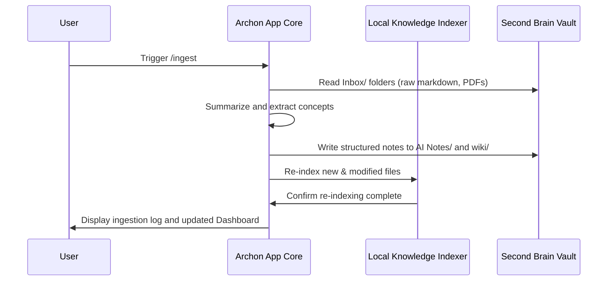
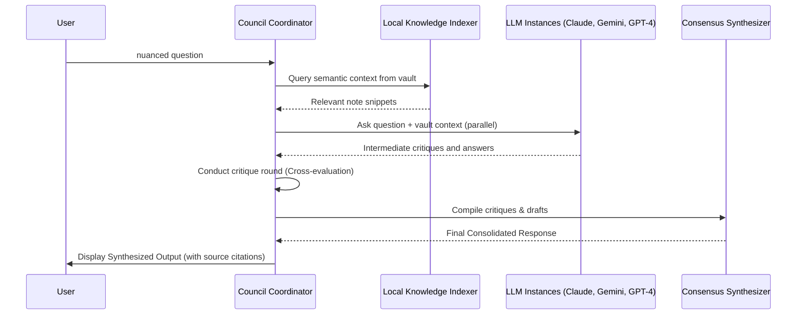
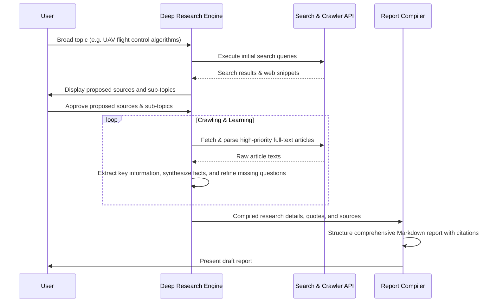

# Archon — Architecture

## System Overview
Archon is designed as a hybrid desktop client and background agent daemon. The application backend is built in Python to natively leverage modern AI orchestrators and semantic indexers, while the frontend is rendered as a clean, responsive desktop panel (using PySide6/Qt or Tauri).

```mermaid
graph TD
    UI[Desktop User Interface] -->|RPC / WebSocket| Core[Archon App Core]
    
    subgraph Knowledge Engine
        Core -->|Query/Update| Indexer[Local Knowledge Indexer]
        Indexer -->|Read/Parse| Vault[(Second Brain Vault)]
    end

    subgraph Execution Engines
        Core -->|Mode 1| Chat[Normal Chat Agent]
        Core -->|Mode 2| Council[Council of AI Debate Orchestrator]
        Core -->|Mode 3| Research[Deep Research Engine]
        Core -->|Mode 4| Agents[Multi-Agent Team Runtime]
    end

    subgraph Autopilot Supervisor (DRAFT - Disabled)
        Agents -.->|Reports State| Supervisor[Supervisor Watchdog Agent]
        Supervisor -.->|Can Halt| Agents
    end

    subgraph System Integrations
        Chat & Council & Research & Agents & Supervisor -->|API Request| Router[Tiered Free-Model Router]
        Router -->|Low RPM / Heavy Reasoning| HeavyAPIs[Gemini 1.5 Pro / Large OpenRouter Models]
        Router -->|High RPM / Fast Chat| FastAPIs[Groq Llama-3 / Cerebras / Gemini Flash]
        Research -->|Web Search/Crawling| WebReader[Tavily/DDG & Web Crawler]
        Agents -->|Subprocess / CLI| OpenCode[OpenCode CLI: opencode run]
        Agents -->|System Controls| ShellRunner[Secure Shell & File System Runner]
        ShellRunner & OpenCode -->|Execute| OS[Windows Local OS]
    end
```

## Core Components

| Component | Responsibility | Tech / Libraries |
|-----------|---------------|------------------|
| **Desktop Front-End** | Renders UI, provides four-mode toggle switch, displays agent conversation graphs, shows live research status, and shows dashboard summaries. | HTML/JS/CSS (Tauri) or Qt/QML (PySide6) |
| **Orchestrator Core** | Handles state management, routing between execution modes, API keys, and secure confirmations. | Python (asyncio, FastAPI / JSON-RPC) |
| **Local Knowledge Indexer** | Parses vault markdown notes, extracts bidirectional links, indexes metadata, and maintains a semantic vector database. | Python, LanceDB / SQLite, SentenceTransformers (local embeddings) |
| **Tiered Free-Model Router** | Manages rate limits (RPM/TPM) for free keys from Gemini, Groq, Cerebras, Mistral, and OpenRouter. Queues API requests and dynamically routes based on task complexity. | Python (LiteLLM or custom async handler) |
| **Council debate layer** | Queries multiple selected LLM APIs/Ollama concurrently, orchestrates critique rounds, and outputs a consensus. | Custom Python debating framework |
| **Deep Research Engine** | Manages multi-step query generation, performs search indexing, crawls web pages/literature, and compiles final cited Markdown reports. **Asks user for source/sub-topic approval before crawling.** | Custom Python agents, Tavily / DuckDuckGo, Playwright / BeautifulSoup |
| **OpenCode CLI Wrapper** | Interfaces with local `opencode` command line tool to smoothly execute AI-guided coding and refactoring tasks. | Python subprocess / JSON-RPC client |
| **Multi-Agent Runtime** | Manages autonomous task queues, spawns specialized subagents (Reader, Writer, Exec), and coordinates handoffs. | CrewAI / LangGraph |
| **Autopilot Supervisor (Draft)** | Watchdog layer that oversees subagent execution runs, evaluates plan completion steps, checks terminal parameters, and enforces system loop-counters. | Custom Python watchdog class / validator agent |
| **Secure Shell Runner** | Interacts with the local system command-line to run tests, scripts, and build tasks. Enforces safety gates. | Python subprocess / PowerShell wrappers |

## Data Flow

### 1. Ingestion / Ingest Mode


### 2. Council of AI Debate Mode


### 3. Deep Research Mode (Web Search Only)


## Security & Constraints
- **Local Isolation:** System file access tools can never read/write outside the designated workspace or vault directory unless explicitly allowed in settings.
- **PowerShell Guardrails:** Destructive shell commands (e.g., deletes, package updates) are intercepted by the secure runner and require a UI confirmation click from the user.
- **API Key Security:** Keys are loaded via local `.env` files (ignored in Git) or system environment variables.
