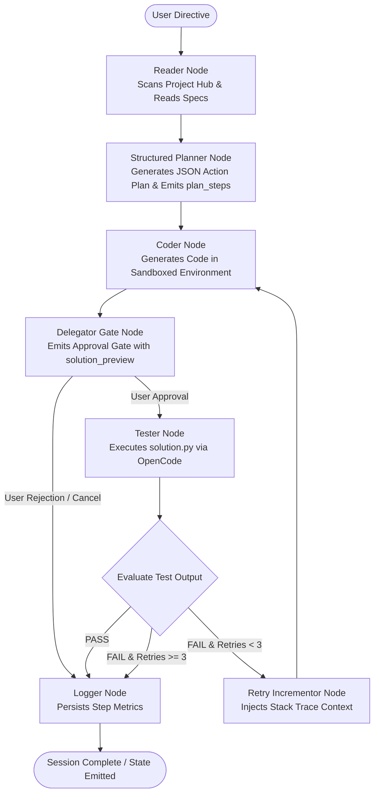

# Archon Architecture Overview

Comprehensive system design, LangGraph agent execution graph, and service subsystem architecture for the Archon AI Operating System.

---

## 1. System Topology Overview

```
                            +-------------------------------------------------+
                            |              Clients & Interfaces               |
                            |  - Next.js / React 19 Web UI (Tailwind v4/shadcn)|
                            |  - Android Native App (Jetpack Compose)         |
                            +------------------------+------------------------+
                                                     | (REST / WebSocket: /ws)
                                                     v
                            +-------------------------------------------------+
                            |            FastAPI Core Daemon Engine           |
                            |  - Mode Multiplexer (Chat, Council, Research,   |
                            |    Agent, Tutor, Audio)                         |
                            |  - Token Auth (HMAC-SHA256 JWT & PBKDF2)        |
                            |  - Quota Enforcer & Circuit Breaker Layer       |
                            |  - Semantic LRU Cache Layer                     |
                            +----+-------------------+--------------------+---+
                                 |                   |                    |
       +-------------------------+                   |                    +-------------------------+
       |                                             |                                              |
       v                                             v                                              v
+------------------+                   +---------------------------+                   +--------------------+
|  LanceDB Vector  |                   |    SQLite System Journal  |                   | OpenCode Subprocess|
| (Textbooks / RAG |                   | (Agent Steps, Metrics,    |                   | (Python Execution, |
|  Chunk Embeddings|                   |  Notebooks, OCR Jobs)     |                   |  Sandboxed Coder)  |
+------------------+                   +---------------------------+                   +--------------------+
       |                                             |                                              |
       +---------------------------------------------+----------------------------------------------+
                                                     |
                                                     v
                                      +-------------------------------+
                                      |     Model Routing Engine      |
                                      | (Qwen Local / Gemini / Claude)|
                                      +-------------------------------+
```

---

## 2. Agent Mode: LangGraph Execution Topology

Archon Agents Mode implements an autonomous agentic loop structured with LangGraph, including human-in-the-loop approval gates, dynamic retry recursion with error context injection, and real-time execution streaming.



### Agent State Schema (`AgentState`)
```python
class AgentState(TypedDict):
    task: str                         # User instructions and task description
    context: str                      # Workspace file listings, background context
    plan: str                         # Human-readable markdown plan
    plan_steps: List[Dict[str, Any]]  # Structured plan steps [{id, title, acceptance_criteria}]
    code: str                         # Generated source code
    test_result: str                  # Output log from execution/testing run
    logs: List[str]                   # Running console trace entries
    retry_count: int                  # Current retry count (capped at 3)
    approved: bool                    # Gate approval flag
    task_id: str                      # Unique UUID for the execution session
    cancelled: bool                   # True if user aborted or rejected
```

---

## 3. Subsystem Architecture

### A. Authentication & Multitenancy (`auth_service.py`)
- Zero-dependency HMAC-SHA256 JWT encoding and decoding.
- PBKDF2-HMAC-SHA256 password hashing with random salt generation.
- Role-based access control (`student`, `teacher`, `admin`) enforced by `quota_enforcer.py`.

### B. High-Reliability Fault Tolerance (`circuit_breaker.py`)
- State machine transition: `CLOSED` -> `OPEN` (upon failure threshold reached) -> `HALF_OPEN` (post-cooldown probe).
- Per-service protection instances across MyScript handwriting recognition, LanceDB vector storage, and primary LLM APIs.

### C. Caching & Throughput (`caching_layer.py`)
- In-memory `LRUCacheWithTTL` and `SemanticCache` preventing redundant vector embeddings and model completions.
- Sub-5ms warm hit latency response.

### D. Process Isolation & Safety (`opencode_client.py`)
- Sandboxed subprocess execution for code verification.
- Proactive process group cleanup and PID tracking to guarantee zero orphan background processes on client disconnection or cancel events.

