# Backend Dependency Graph

```mermaid
graph TD
    agent_journal["agent_journal"]
    agent_runtime["agent_runtime"] --> base_agent["base_agent"]
    agent_runtime["agent_runtime"] --> model_router["model_router"]
    agent_runtime["agent_runtime"] --> vault_search["vault_search"]
    agent_runtime["agent_runtime"] --> markit_down["markit_down"]
    agent_runtime["agent_runtime"] --> opencode_client["opencode_client"]
    agent_runtime["agent_runtime"] --> autopilot_supervisor["autopilot_supervisor"]
    agent_runtime["agent_runtime"] --> agent_journal["agent_journal"]
    agent_runtime["agent_runtime"] --> config["config"]
    audio_overview["audio_overview"] --> base_agent["base_agent"]
    audio_overview["audio_overview"] --> model_router["model_router"]
    audio_overview["audio_overview"] --> retriever["retriever"]
    audio_overview["audio_overview"] --> config["config"]
    audio_processor["audio_processor"] --> config["config"]
    auth_middleware["auth_middleware"] --> auth_service["auth_service"]
    auth_service["auth_service"]
    autopilot_supervisor["autopilot_supervisor"]
    backup_scheduler["backup_scheduler"]
    base_agent["base_agent"]
    caching_layer["caching_layer"]
    calendar_service["calendar_service"]
    chat_agent["chat_agent"] --> base_agent["base_agent"]
    chat_agent["chat_agent"] --> model_router["model_router"]
    chat_agent["chat_agent"] --> vault_search["vault_search"]
    chat_agent["chat_agent"] --> markit_down["markit_down"]
    chat_agent["chat_agent"] --> config["config"]
    chat_grounded["chat_grounded"] --> base_agent["base_agent"]
    chat_grounded["chat_grounded"] --> model_router["model_router"]
    chat_grounded["chat_grounded"] --> retriever["retriever"]
    chat_grounded["chat_grounded"] --> citation_verifier["citation_verifier"]
    circuit_breaker["circuit_breaker"]
    citation_verifier["citation_verifier"] --> model_router["model_router"]
    config["config"]
    council_debate["council_debate"] --> base_agent["base_agent"]
    council_debate["council_debate"] --> model_router["model_router"]
    council_debate["council_debate"] --> vault_search["vault_search"]
    council_debate["council_debate"] --> markit_down["markit_down"]
    data_augmenter["data_augmenter"]
    ecc_bridge["ecc_bridge"]
    embeddings["embeddings"]
    error_handlers["error_handlers"]
    health_check["health_check"] --> config["config"]
    image_renderer["image_renderer"]
    ingestion_queue["ingestion_queue"]
    lecture_agents["lecture_agents"] --> model_router["model_router"]
    lecture_job_queue["lecture_job_queue"] --> config["config"]
    lecture_routes["lecture_routes"] --> lecture_job_queue["lecture_job_queue"]
    lecture_routes["lecture_routes"] --> audio_processor["audio_processor"]
    lecture_routes["lecture_routes"] --> note_generator["note_generator"]
    lecture_routes["lecture_routes"] --> auth_middleware["auth_middleware"]
    lecture_routes["lecture_routes"] --> config["config"]
    lecture_routes["lecture_routes"] --> notion_exporter["notion_exporter"]
    main["main"] --> chat_agent["chat_agent"]
    main["main"] --> council_debate["council_debate"]
    main["main"] --> agent_runtime["agent_runtime"]
    main["main"] --> model_router["model_router"]
    main["main"] --> vault_search["vault_search"]
    main["main"] --> markit_down["markit_down"]
    main["main"] --> calendar_service["calendar_service"]
    main["main"] --> ingestion_queue["ingestion_queue"]
    main["main"] --> config["config"]
    main["main"] --> auth_service["auth_service"]
    main["main"] --> auth_middleware["auth_middleware"]
    main["main"] --> retriever["retriever"]
    main["main"] --> notebook_routes["notebook_routes"]
    main["main"] --> lecture_routes["lecture_routes"]
    main["main"] --> tutor_routes["tutor_routes"]
    main["main"] --> ocr_routes["ocr_routes"]
    main["main"] --> health_check["health_check"]
    main["main"] --> notebook_routes["notebook_routes"]
    main["main"] --> news_service["news_service"]
    main["main"] --> scaling_monitor["scaling_monitor"]
    main["main"] --> scaling_monitor["scaling_monitor"]
    main["main"] --> monitoring_metrics["monitoring_metrics"]
    main["main"] --> offline_queue["offline_queue"]
    main["main"] --> offline_queue["offline_queue"]
    main["main"] --> offline_queue["offline_queue"]
    main["main"] --> offline_queue["offline_queue"]
    main["main"] --> offline_queue["offline_queue"]
    main["main"] --> notebook_routes["notebook_routes"]
    main["main"] --> notebook_routes["notebook_routes"]
    main["main"] --> notebook_routes["notebook_routes"]
    main["main"] --> config["config"]
    main["main"] --> monitoring_metrics["monitoring_metrics"]
    markit_down["markit_down"]
    metadata_extractor["metadata_extractor"] --> image_renderer["image_renderer"]
    model_evaluator["model_evaluator"]
    model_router["model_router"] --> config["config"]
    model_router["model_router"] --> semantic_cache["semantic_cache"]
    monitoring_alerts["monitoring_alerts"]
    monitoring_metrics["monitoring_metrics"] --> config["config"]
    monthly_finetuning_cron["monthly_finetuning_cron"] --> training_data_collector["training_data_collector"]
    monthly_finetuning_cron["monthly_finetuning_cron"] --> data_augmenter["data_augmenter"]
    monthly_finetuning_cron["monthly_finetuning_cron"] --> tesstrain_pipeline["tesstrain_pipeline"]
    monthly_finetuning_cron["monthly_finetuning_cron"] --> model_evaluator["model_evaluator"]
    news_service["news_service"]
    notebook_routes["notebook_routes"] --> model_router["model_router"]
    notebook_routes["notebook_routes"] --> retriever["retriever"]
    notebook_routes["notebook_routes"] --> chat_grounded["chat_grounded"]
    notebook_routes["notebook_routes"] --> studio["studio"]
    notebook_routes["notebook_routes"] --> audio_overview["audio_overview"]
    notebook_routes["notebook_routes"] --> auth_middleware["auth_middleware"]
    notebook_routes["notebook_routes"] --> quota_enforcer["quota_enforcer"]
    notebook_routes["notebook_routes"] --> main["main"]
    notebook_routes["notebook_routes"] --> main["main"]
    notebook_routes["notebook_routes"] --> main["main"]
    notebook_routes["notebook_routes"] --> quota_enforcer["quota_enforcer"]
    notebook_routes["notebook_routes"] --> config["config"]
    note_generator["note_generator"] --> model_router["model_router"]
    note_generator["note_generator"] --> lecture_agents["lecture_agents"]
    notion_converter["notion_converter"]
    notion_exporter["notion_exporter"] --> notion_converter["notion_converter"]
    ocr_routes["ocr_routes"]
    offline_queue["offline_queue"] --> config["config"]
    opencode_client["opencode_client"] --> config["config"]
    performance_benchmark["performance_benchmark"] --> main["main"]
    performance_benchmark["performance_benchmark"] --> query_optimizer["query_optimizer"]
    performance_benchmark["performance_benchmark"] --> performance_report["performance_report"]
    performance_report["performance_report"]
    query_optimizer["query_optimizer"]
    quota_enforcer["quota_enforcer"]
    recovery_tool["recovery_tool"]
    resource_pooling["resource_pooling"]
    retriever["retriever"] --> model_router["model_router"]
    retriever["retriever"] --> embeddings["embeddings"]
    retriever["retriever"] --> embeddings["embeddings"]
    retry_decorator["retry_decorator"]
    scaling_monitor["scaling_monitor"] --> config["config"]
    schema_migration["schema_migration"]
    semantic_cache["semantic_cache"]
    shell_runner["shell_runner"] --> config["config"]
    shell_runner["shell_runner"] --> ecc_bridge["ecc_bridge"]
    structured_logging["structured_logging"]
    studio["studio"] --> base_agent["base_agent"]
    studio["studio"] --> model_router["model_router"]
    studio["studio"] --> retriever["retriever"]
    tesstrain_pipeline["tesstrain_pipeline"]
    training_data_collector["training_data_collector"] --> image_renderer["image_renderer"]
    training_data_collector["training_data_collector"] --> metadata_extractor["metadata_extractor"]
    tutor_routes["tutor_routes"] --> auth_middleware["auth_middleware"]
    tutor_routes["tutor_routes"] --> quota_enforcer["quota_enforcer"]
    tutor_routes["tutor_routes"] --> notebook_routes["notebook_routes"]
    tutor_routes["tutor_routes"] --> monthly_finetuning_cron["monthly_finetuning_cron"]
    tutor_routes["tutor_routes"] --> agents_tutor_training["agents.tutor_training"]
    vault_graph_service["vault_graph_service"]
    vault_parser["vault_parser"]
    vault_search["vault_search"] --> vault_parser["vault_parser"]
    weekly_finetuning_cron["weekly_finetuning_cron"] --> training_data_collector["training_data_collector"]
    agents_ocr_finetuning["agents.ocr_finetuning"]
    agents_tutor_training["agents.tutor_training"]
    scripts_lecture_to_notes["scripts.lecture_to_notes"] --> config["config"]
    scripts_lecture_to_notes["scripts.lecture_to_notes"] --> model_router["model_router"]
    scripts_lecture_to_notes["scripts.lecture_to_notes"] --> retriever["retriever"]
    scripts_lecture_to_notes["scripts.lecture_to_notes"] --> audio_processor["audio_processor"]
    scripts_lecture_to_notes["scripts.lecture_to_notes"] --> note_generator["note_generator"]
    tests_conftest["tests.conftest"]
    tests_test_adversarial_attachments["tests.test_adversarial_attachments"] --> main["main"]
    tests_test_agents["tests.test_agents"] --> chat_agent["chat_agent"]
    tests_test_agents["tests.test_agents"] --> council_debate["council_debate"]
    tests_test_agents["tests.test_agents"] --> agent_runtime["agent_runtime"]
    tests_test_agents["tests.test_agents"] --> model_router["model_router"]
    tests_test_agents["tests.test_agents"] --> vault_search["vault_search"]
    tests_test_agents["tests.test_agents"] --> markit_down["markit_down"]
    tests_test_agents["tests.test_agents"] --> opencode_client["opencode_client"]
    tests_test_agent_journal["tests.test_agent_journal"] --> agent_journal["agent_journal"]
    tests_test_auth_isolation["tests.test_auth_isolation"] --> auth_service["auth_service"]
    tests_test_auth_isolation["tests.test_auth_isolation"] --> quota_enforcer["quota_enforcer"]
    tests_test_challenger_sync_strokes["tests.test_challenger_sync_strokes"] --> main["main"]
    tests_test_challenger_sync_strokes["tests.test_challenger_sync_strokes"] --> notebook_routes["notebook_routes"]
    tests_test_e2e_notebook["tests.test_e2e_notebook"] --> notebook_routes["notebook_routes"]
    tests_test_e2e_notebook["tests.test_e2e_notebook"] --> main["main"]
    tests_test_e2e_notebook["tests.test_e2e_notebook"] --> retriever["retriever"]
    tests_test_e2e_notebook["tests.test_e2e_notebook"] --> model_router["model_router"]
    tests_test_e2e_notebook["tests.test_e2e_notebook"] --> notebook_routes["notebook_routes"]
    tests_test_finetuning_flow["tests.test_finetuning_flow"] --> training_data_collector["training_data_collector"]
    tests_test_finetuning_flow["tests.test_finetuning_flow"] --> data_augmenter["data_augmenter"]
    tests_test_finetuning_flow["tests.test_finetuning_flow"] --> tesstrain_pipeline["tesstrain_pipeline"]
    tests_test_finetuning_flow["tests.test_finetuning_flow"] --> model_evaluator["model_evaluator"]
    tests_test_finetuning_flow["tests.test_finetuning_flow"] --> monthly_finetuning_cron["monthly_finetuning_cron"]
    tests_test_grounded_adversarial["tests.test_grounded_adversarial"] --> chat_grounded["chat_grounded"]
    tests_test_grounded_adversarial["tests.test_grounded_adversarial"] --> citation_verifier["citation_verifier"]
    tests_test_grounded_adversarial["tests.test_grounded_adversarial"] --> model_router["model_router"]
    tests_test_grounded_adversarial["tests.test_grounded_adversarial"] --> retriever["retriever"]
    tests_test_ingestion_queue["tests.test_ingestion_queue"] --> main["main"]
    tests_test_ingestion_queue["tests.test_ingestion_queue"] --> ingestion_queue["ingestion_queue"]
    tests_test_integration["tests.test_integration"] --> vault_parser["vault_parser"]
    tests_test_integration["tests.test_integration"] --> model_router["model_router"]
    tests_test_integration["tests.test_integration"] --> opencode_client["opencode_client"]
    tests_test_main["tests.test_main"] --> main["main"]
    tests_test_model_router["tests.test_model_router"] --> model_router["model_router"]
    tests_test_notebook_routes["tests.test_notebook_routes"] --> main["main"]
    tests_test_notebook_routes["tests.test_notebook_routes"] --> main["main"]
    tests_test_notebook_routes["tests.test_notebook_routes"] --> notebook_routes["notebook_routes"]
    tests_test_opencode_client["tests.test_opencode_client"] --> opencode_client["opencode_client"]
    tests_test_performance["tests.test_performance"] --> caching_layer["caching_layer"]
    tests_test_performance["tests.test_performance"] --> auth_service["auth_service"]
    tests_test_performance["tests.test_performance"] --> auth_service["auth_service"]
    tests_test_performance["tests.test_performance"] --> circuit_breaker["circuit_breaker"]
    tests_test_performance["tests.test_performance"] --> backup_scheduler["backup_scheduler"]
    tests_test_performance["tests.test_performance"] --> quota_enforcer["quota_enforcer"]
    tests_test_semantic_cache["tests.test_semantic_cache"] --> semantic_cache["semantic_cache"]
    tests_test_strokes_stress["tests.test_strokes_stress"] --> main["main"]
    tests_test_strokes_stress["tests.test_strokes_stress"] --> notebook_routes["notebook_routes"]
    tests_test_studio_audio["tests.test_studio_audio"] --> studio["studio"]
    tests_test_studio_audio["tests.test_studio_audio"] --> audio_overview["audio_overview"]
    tests_test_studio_audio["tests.test_studio_audio"] --> model_router["model_router"]
    tests_test_studio_audio["tests.test_studio_audio"] --> retriever["retriever"]
    tests_test_vault_parser["tests.test_vault_parser"] --> vault_parser["vault_parser"]
```

## Analysis

### Major Dependency Clusters
1. **Agent Runtime Cluster (`agent_runtime`, `base_agent`, `model_router`)**: A strong cluster centered around `agent_runtime` that orchestrates all LLM calls, tools (`vault_search`, `markit_down`), and sub-agents.
2. **API Routes Cluster (`main`, `notebook_routes`, `lecture_routes`)**: The `main` module acts as the entrypoint, pulling in various specialized route modules. `notebook_routes` in particular is heavily dependent on core functionalities like `quota_enforcer`, `chat_grounded`, and `model_router`.
3. **Background/Cron Jobs Cluster (`monthly_finetuning_cron`, `training_data_collector`, `tesstrain_pipeline`)**: Dedicated to background processing and ML finetuning, loosely coupled from the rest but heavily reliant on data pipelines.

### Circular or Problematic Imports
1. **Circular Import:** `main -> notebook_routes -> main`
   This is a critical flaw. `notebook_routes` shouldn't depend back on `main`. This is likely due to `notebook_routes` importing the `app` instance or global configs defined in `main`.
2. **Fat Entrypoint:** `main` directly imports almost every service, route, and background queue (like `offline_queue` imported 5 times).

### Recommendations
1. **Fix Circular Dependency:** Extract the FastAPI `app` initialization or global dependencies into a separate `dependencies.py` or `app_state.py` file to break the `main -> notebook_routes -> main` cycle.
2. **Dependency Injection:** Use FastAPI's dependency injection instead of hardcoding service imports inside route modules, to decouple routes from concrete service implementations.
3. **Decouple Main:** Instead of `main` directly importing every queue and monitor, have specialized modules register themselves or use an event-driven initialization pattern.

