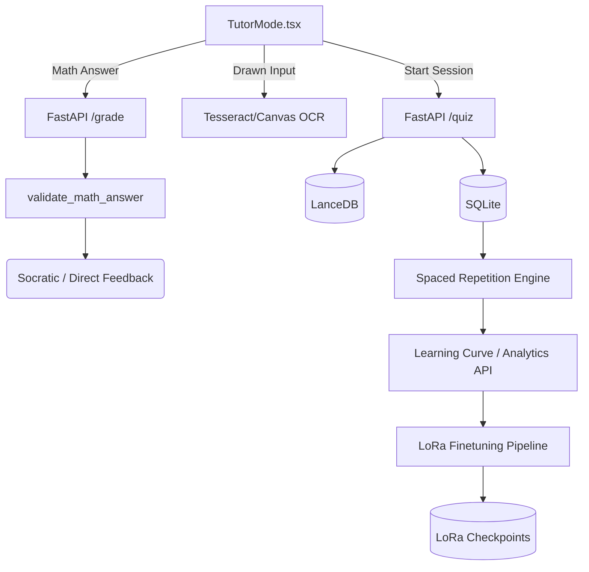

# Tutor Mode (Archon)

## 1. Overview
Tutor Mode is the interactive learning environment of the Archon OS. It bridges traditional note-taking and AI-assisted pedagogy by providing socratic feedback, interactive quizzes, automated math grading, handwriting recognition for drawn inputs, spaced repetition, and an integrated pipeline to dynamically fine-tune tutoring models based on student performance.

## 2. Architecture & Data Flow

## 3. Key API Endpoints & WebSocket Messages
- `GET /notebooks/{notebook_id}/quiz`: Retrieves quiz questions filtered by topic, difficulty, or spaced repetition schedule.
- `POST /notebooks/{notebook_id}/grade`: Automatically grades math input (LaTeX).
  - *Request*: `{ student_answer_latex: string, expected_answer_latex: string, topic: string }`
  - *Response*: `{ is_correct: boolean, score: float, error_type: string, feedback: string }`
- `GET /notebooks/{notebook_id}/analytics/by-topic`: Provides accuracy, attempt count, and time spent per topic.
- `GET /notebooks/{notebook_id}/analytics/learning-curve`: Returns a timeline of student scores for visualization.
- `GET /notebooks/{notebook_id}/analytics/spaced-repetition-status`: Returns counts for `due_today`, `struggling_count`, and `mastered_count`.
- `POST /notebooks/{notebook_id}/trigger-training`: Triggers a LoRa fine-tuning job via `TutorTrainingPipeline`.
- `GET /notebooks/{notebook_id}/training-status`: Polling endpoint for model training progress.

## 4. Data Models / Database Schema
Data resides primarily in the LanceDB RAG cache and a local SQLite engine `quiz_manager`.
- **quiz_questions_table**: 
  - `question_id` (str)
  - `user_id` (str)
  - `notebook_id` (str)
  - `topic` (str)
  - `question_text` (str)
  - `expected_answer` (str)
  - `difficulty` (int)
  - `spaced_repetition_json` (stringified JSON) -> `{ ease: float, repetitions: int, next_review_date: timestamp }`
- **quiz_attempts_table**:
  - `attempt_id` (str)
  - `question_id` (str)
  - `user_id` (str)
  - `notebook_id` (str)
  - `score` (float)
  - `is_correct` (boolean)
  - `time_spent_seconds` (int)
  - `timestamp_started` (float)

## 5. UI Component Tree
- `TutorMode` (Main View)
  - `ScrollArea` (Main content panel)
    - `Canvas / Handwriting Input` (For drawn input and Tesseract recognition)
    - `Quiz Controls` (Submit Answer, Clear, Show Hint)
    - `Grading View` (Concept, Reasoning, and Form scores progress bars + Socratic follow-up box)
  - `Right Panel (Reference)`
    - Blur-protected standard curriculum answers

## 6. Android Implementation
- Integrates via React Native Webview or custom API bindings fetching from `/notebooks/{notebook_id}/...`.
- Mobile-specific drawing capabilities map touch events to the canvas for Tesseract OCR.
- Caches SR questions via local SQLite equivalent to allow offline reviewing if synced.

## 7. Known Issues / Open TODOs
- **OCR Accuracy**: The Tesseract bounding box model occasionally misinterprets complex integral limits. Needs a custom finetune (baseline accuracy is currently ~71.5%).
- **Socratic Loop Limits**: Sometimes the AI gives the answer away after only 1 hint instead of continuing the Socratic method.
- **LoRa Checkpoint Size**: Continual finetuning per notebook can bloat disk space; a pruning mechanism for outdated checkpoints is needed.
