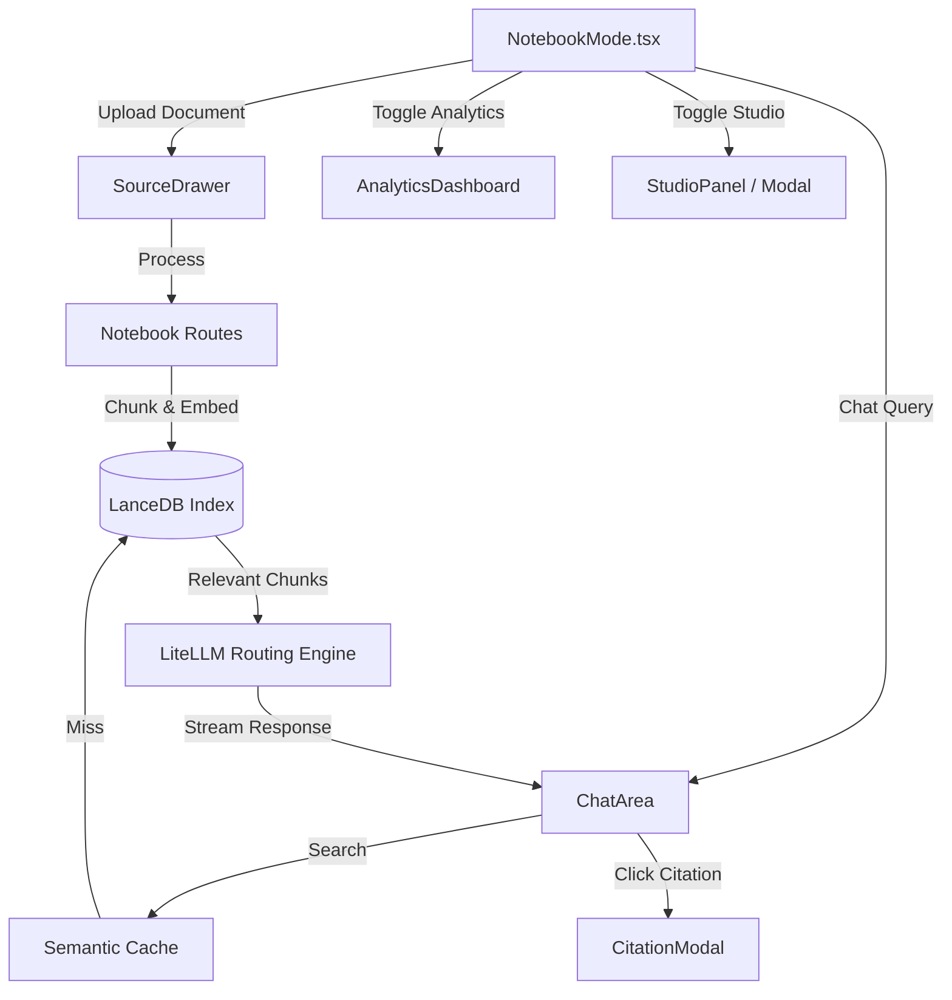

# Notebook / RAG Mode (Archon)

## 1. Overview
Notebook / RAG Mode serves as the central hub for user knowledge and document interactions in the Archon OS. It combines traditional note-taking structures with Retrieval-Augmented Generation (RAG) powered by LanceDB. Users can upload source materials, chat directly with those materials, view citations, and examine generated analytics and studio artifacts.

## 2. Architecture & Data Flow

## 3. Key API Endpoints & WebSocket Messages
- `POST /api/notebooks/{id}/upload`: Processes uploaded documents (PDF, TXT, MD), chunks them, generates embeddings, and indexes them in LanceDB.
- `GET /api/notebooks/{id}/documents`: Retrieves the list of parsed documents in the current notebook.
- `POST /api/notebooks/{id}/chat`: Sends a message to the RAG backend, retrieving context and generating an answer. Returns streaming tokens.
- `GET /api/notebooks/{id}/citations/{citation_id}`: Retrieves the exact chunk and surrounding context for a citation reference.

## 4. Data Models / Database Schema
- **LanceDB Collection (`documents`)**:
  - `id`: str (Unique chunk ID)
  - `notebook_id`: str
  - `document_name`: str
  - `content`: str
  - `vector`: float[] (Embedding array)
  - `metadata`: JSON (page number, section, hierarchy)
- **SQLite Engine (`notebook_metadata`)**:
  - `notebook_id`: str (Primary Key)
  - `user_id`: str
  - `title`: str
  - `created_at`: timestamp
  - `updated_at`: timestamp

## 5. UI Component Tree
- `NotebookMode` (Context Provider)
  - `NotebookSidebar` (Notebook navigation & management)
  - `ChatArea` (Main LLM chat interface, syntax highlighting, RAG streaming)
  - `AnalyticsDashboard` (Visual insights into topics discussed and material coverage)
  - `StudioPanel` / `StudioModal` (Canvas for interactive artifacts, visualizations, and dynamic diagrams)
  - `SourceDrawer` (Slide-out menu for uploading/managing PDFs, images, code files)
  - `CitationModal` (Pop-up displaying the direct text block a chat claim was sourced from)

## 6. Android Implementation
- Features a bottom-sheet based layout for `SourceDrawer` to accommodate smaller screens.
- Replaces standard Markdown components with mobile-optimized native text rendering to preserve battery and RAM.
- Employs a local vector store proxy (if supported by device) or delegates purely to the remote LanceDB.

## 7. Known Issues / Open TODOs
- **Semantic Cache Invalidations**: When documents are deleted, the cache sometimes serves stale RAG answers until it is explicitly flushed.
- **Large PDF Processing**: Uploading PDFs > 50MB occasionally times out the FastAPI backend. Chunking processing needs to be moved to a background Celery/Redis worker.
- **Studio Artifact Mobile View**: Complex D3/Mermaid diagrams in the StudioModal break on small Android screens. Needs responsive redesign or pinch-to-zoom support.
