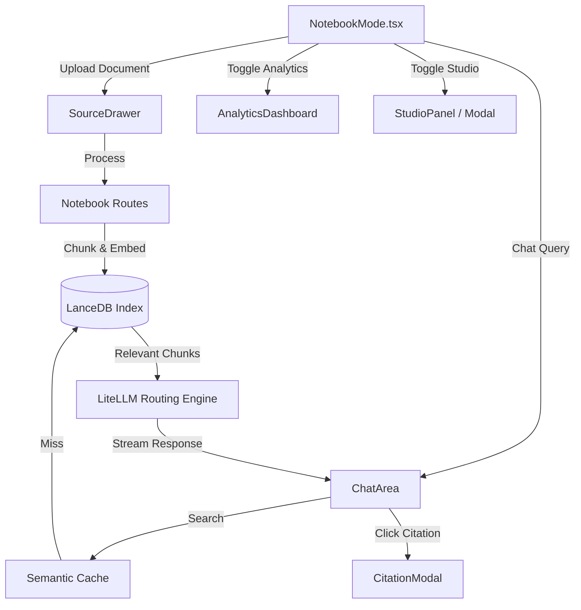

# Notebook / RAG Mode (Archon)

## 1. Overview
Notebook / RAG Mode serves as the central hub for user knowledge and document interactions in the Archon OS. It combines traditional note-taking structures with Retrieval-Augmented Generation (RAG) powered by LanceDB. Users can upload source materials, chat directly with those materials, view citations, and examine generated analytics and studio artifacts.

## 2. Architecture & Data Flow

## 3. Key API Endpoints & WebSocket Messages
- `POST /notebooks`: Creates a new notebook collection (`{"name": "..."}`).
- `GET /notebooks`: Retrieves all notebooks for the authenticated user.
- `GET /notebooks/{notebook_id}`: Retrieves specific notebook metadata and attached sources.
- `POST /notebooks/{notebook_id}/sources`: Uploads and queues source documents (multipart/form-data with `source_type`: "pdf" | "codebase" | "audio" and `file`), processed via `IngestionQueue` and indexed in LanceDB.
- `GET /jobs/{job_id}`: Polling endpoint for document ingestion and embedding status.
- `POST /notebooks/{notebook_id}/query`: Executes semantic search against indexed notebook chunks with cosine similarity ranking.
- `GET /notebooks/{notebook_id}/citations/{chunk_id}`: Retrieves the exact chunk text, page number, and source file metadata for inline citation cards.

## 4. Data Models / Database Schema
- **LanceDB Collection (`documents`)**:
  - `id`: str (Unique chunk ID)
  - `notebook_id`: str
  - `document_name`: str
  - `content`: str
  - `vector`: float[] (Embedding array)
  - `metadata`: JSON (page number, section, hierarchy)
- **SQLite Engine (`notebook_metadata`)**:
  - `notebook_id`: str (Primary Key)
  - `user_id`: str
  - `title`: str
  - `created_at`: timestamp
  - `updated_at`: timestamp

## 5. UI Component Tree
- `NotebookMode` (Context Provider)
  - `NotebookSidebar` (Notebook navigation & management)
  - `ChatArea` (Main LLM chat interface, syntax highlighting, RAG streaming)
  - `AnalyticsDashboard` (Visual insights into topics discussed and material coverage)
  - `StudioPanel` / `StudioModal` (Canvas for interactive artifacts, visualizations, and dynamic diagrams)
  - `SourceDrawer` (Slide-out menu for uploading/managing PDFs, images, code files)
  - `CitationModal` (Pop-up displaying the direct text block a chat claim was sourced from)

## 6. Android Implementation
- Features a bottom-sheet based layout for `SourceDrawer` to accommodate smaller screens.
- Replaces standard Markdown components with mobile-optimized native text rendering to preserve battery and RAM.
- Employs a local vector store proxy (if supported by device) or delegates purely to the remote LanceDB.

## 7. Reference Products & Visual Benchmarks

* **Google NotebookLM (notebooklm.google.com):** The closest working analog to Archon's Notebook Mode. NotebookLM's 3-pane layout is the direct visual reference:
  - **Sources pane (left):** Uploaded PDFs, Google Docs, YouTube links listed with document thumbnails. Maps to Archon's `SourceDrawer`.
  - **Chat pane (center):** Grounded answers with inline clickable citation badges (`[1]`, `[2]`) that highlight the source chunk. Maps to Archon's `ChatArea` + `CitationModal`.
  - **Studio pane (right):** Generated summaries, podcast-style audio overviews, and study guides. Maps to Archon's `StudioPanel`.
  - **Key behavior:** Clicking a citation badge does NOT navigate away — it highlights the source in the Sources pane inline. Archon's `CitationModal` should mirror this anchored pattern.
* **Stanford STORM:** Reference for the synthesis pipeline. STORM generates multi-perspective research reports by pre-generating expert personas and having them interrogate source material before writing. Maps to Archon's `GroundedChatAgent` two-pass draft-then-verify pattern.
* **PC ↔ Android Parity:** Both platforms expose Sources / Chat / Studio as the core three-panel mental model. Android compresses to a bottom-sheet `SourceDrawer` and a tab bar for Studio vs Chat, but the underlying RAG pipeline and citation model are identical.

## 8. Known Issues / Open TODOs
- **Semantic Cache Invalidations**: When documents are deleted, the cache sometimes serves stale RAG answers until it is explicitly flushed.
- **Large PDF Processing**: Uploading PDFs > 50MB occasionally times out the FastAPI backend. Chunking processing needs to be moved to a background Celery/Redis worker.
- **Studio Artifact Mobile View**: Complex D3/Mermaid diagrams in the StudioModal break on small Android screens. Needs responsive redesign or pinch-to-zoom support.
