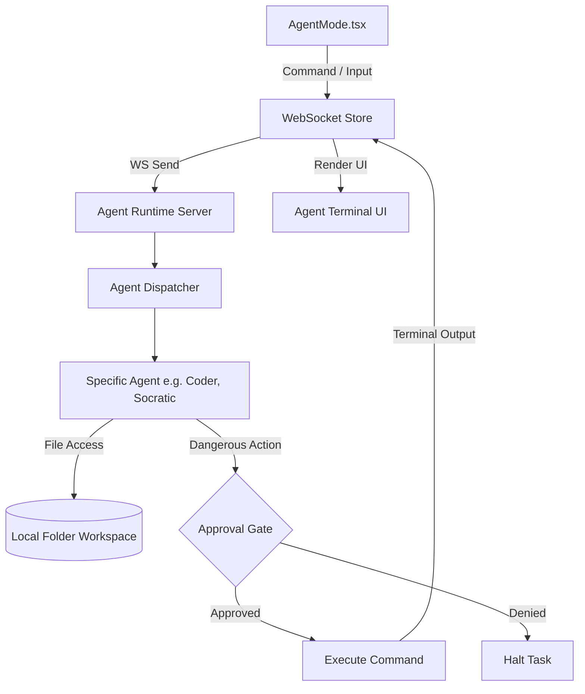

# Agents Mode (Archon)

## 1. Overview
Agents Mode acts as an orchestration environment for creating, managing, and interacting with specialized AI agents (`chat_agent.py`, `lecture_agents.py`, `socratic_agent.py`, etc.). It allows users to define an Agent Project, link it to a specific local folder, and run terminal-like commands. The system includes a strict approval layer ("Dangerous Command") to prevent unauthorized destructive actions on the filesystem.

## 2. Architecture & Data Flow

## 3. Key API Endpoints & WebSocket Messages
- `WS Send: sendAgentCommand(cmd)`: Dispatch a command to the currently active agent.
- `WS Event: "terminal_line"`: Streams output text back to the React UI, tagged with `kind: "system" | "input" | "output" | "warning" | "error" | "success"`.
- `WS Event: "dangerous_command"`: Notifies the UI that an agent intends to run a system-altering action (e.g. `rm`, `git push`, file overwrite).
- `WS Send: approveCommand()` / `denyCommand()`: User response to the `dangerous_command` gate.
- `WS Event: "agent_status"`: Updates the queue status -> `complete`, `running`, `queued`, `failed`.

## 4. Data Models / Database Schema
- **ProjectsContext (Frontend State)**:
  - `id`: str
  - `name`: str
  - `kind`: `"agent"`
  - `path`: str (Absolute path on the local OS to act as the agent's sandbox)
- **Agent Memory/Journal (`agent_journal.py`)**:
  - Locally stored JSON lines / SQLite database that tracks past agent interactions, code edits, and user preferences per project to maintain context between sessions.

## 5. UI Component Tree
- `AgentMode` (Main View)
  - `NewAgentProjectBlocker` (Forces user to select a valid local directory before proceeding)
  - `Header Bar` (Displays active agent status, current task queue)
  - `Terminal View` (Renders `terminalLines` array with color-coded tags)
  - `Input Area`
    - File attachment handler (`useFileAttach`)
    - Command Input Textbox
  - `Approval Modal` (Pops up when `dangerousCommand` is populated, blocking execution until user interaction)

## 6. Android Implementation
- Since full filesystem access on Android is heavily restricted (Scoped Storage), Agent Mode on mobile acts primarily as a remote terminal to a desktop-hosted Archon instance.
- Users can review code diffs and approve/deny `dangerous_commands` via push notifications.
- Local execution on Android is limited to a sandboxed app-specific directory.

## 7. Reference Products & Visual Benchmarks

* **Devin (cognition.ai):** Primary reference for the step-by-step visual execution model. Devin's UI shows a persistent left-side phase progression panel (`Plan → Explore → Execute → Verify`) with each phase expandable to show tool calls and sub-actions. Maps directly to Archon's terminal-line event stream tagged by phase (`system`, `input`, `output`, `warning`, `success`).
  - **Phase progression bar:** Users always know which stage the agent is in and what the next step will be.
  - **Collapsible tool logs:** Each tool call (file read, shell command, search) is shown as a collapsible row — readable without flooding the terminal.
* **Cursor (cursor.sh):** Reference for the human-in-the-loop review layer. Cursor's inline diff viewer shows exactly what lines changed before any file is written, with explicit Accept / Reject buttons. Maps to Archon's `dangerous_command` approval modal — users review the proposed action before granting execution.
  - **Inline file diffs:** Color-coded `+/-` diff blocks for any file mutation.
  - **Approve / Reject gates:** Blocked execution until explicit user confirmation.
* **PC ↔ Android Parity:** On Android, agents execute on the desktop instance; the tablet acts as a remote monitoring + approval terminal. Push notifications surface `dangerous_command` events so the user can approve/deny from the tablet without being seated at the PC.

## 8. Known Issues / Open TODOs
- **Terminal State Persistence**: Reloading the frontend clears the terminal UI, though the backend maintains the session. A mechanism to fetch terminal history on mount is needed.
- **Context Windows**: Long-running agent tasks fill up the context window. Summarization or sliding-window memory needs to be improved in `base_agent.py`.
- **Sandboxing Limits**: The current directory restrictions check paths loosely. Tighter chroot or Docker-based sandboxing is required for true security against malicious agent behavior.
