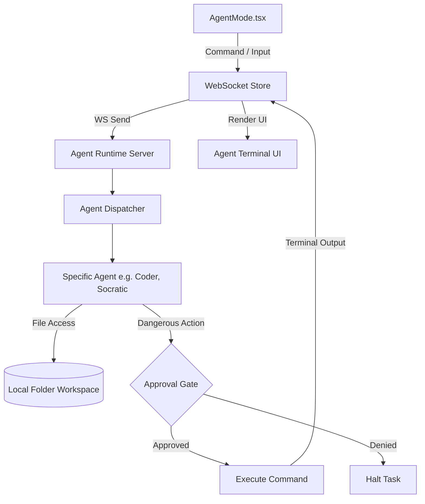

# Agents Mode (Archon)

## 1. Overview
Agents Mode acts as an orchestration environment for creating, managing, and interacting with specialized AI agents (`chat_agent.py`, `lecture_agents.py`, `socratic_agent.py`, etc.). It allows users to define an Agent Project, link it to a specific local folder, and run terminal-like commands. The system includes a strict approval layer ("Dangerous Command") to prevent unauthorized destructive actions on the filesystem.

## 2. Architecture & Data Flow



## 3. Key API Endpoints & WebSocket Messages
- `WS Send: sendAgentCommand(cmd)`: Dispatch a command to the currently active agent.
- `WS Event: "terminal_line"`: Streams output text back to the React UI, tagged with `kind: "system" | "input" | "output" | "warning" | "error" | "success"`.
- `WS Event: "dangerous_command"`: Notifies the UI that an agent intends to run a system-altering action (e.g. `rm`, `git push`, file overwrite).
- `WS Send: approveCommand()` / `denyCommand()`: User response to the `dangerous_command` gate.
- `WS Event: "agent_status"`: Updates the queue status -> `complete`, `running`, `queued`, `failed`.

## 4. Data Models / Database Schema
- **ProjectsContext (Frontend State)**:
  - `id`: str
  - `name`: str
  - `kind`: `"agent"`
  - `path`: str (Absolute path on the local OS to act as the agent's sandbox)
- **Agent Memory/Journal (`agent_journal.py`)**:
  - Locally stored JSON lines / SQLite database that tracks past agent interactions, code edits, and user preferences per project to maintain context between sessions.

## 5. UI Component Tree
- `AgentMode` (Main View)
  - `NewAgentProjectBlocker` (Forces user to select a valid local directory before proceeding)
  - `Header Bar` (Displays active agent status, current task queue)
  - `Terminal View` (Renders `terminalLines` array with color-coded tags)
  - `Input Area`
    - File attachment handler (`useFileAttach`)
    - Command Input Textbox
  - `Approval Modal` (Pops up when `dangerousCommand` is populated, blocking execution until user interaction)

## 6. Android Implementation
- Since full filesystem access on Android is heavily restricted (Scoped Storage), Agent Mode on mobile acts primarily as a remote terminal to a desktop-hosted Archon instance.
- Users can review code diffs and approve/deny `dangerous_commands` via push notifications.
- Local execution on Android is limited to a sandboxed app-specific directory.

## 7. Reference Products & Visual Benchmarks

* **Devin (cognition.ai):** Primary reference for the step-by-step visual execution model. Devin's UI shows a persistent left-side phase progression panel (`Plan → Explore → Execute → Verify`) with each phase expandable to show tool calls and sub-actions. Maps directly to Archon's terminal-line event stream tagged by phase (`system`, `input`, `output`, `warning`, `success`).
  - **Phase progression bar:** Users always know which stage the agent is in and what the next step will be.
  - **Collapsible tool logs:** Each tool call (file read, shell command, search) is shown as a collapsible row — readable without flooding the terminal.
* **Cursor (cursor.sh):** Reference for the human-in-the-loop review layer. Cursor's inline diff viewer shows exactly what lines changed before any file is written, with explicit Accept / Reject buttons. Maps to Archon's `dangerous_command` approval modal — users review the proposed action before granting execution.
  - **Inline file diffs:** Color-coded `+/-` diff blocks for any file mutation.
  - **Approve / Reject gates:** Blocked execution until explicit user confirmation.
* **PC ↔ Android Parity:** On Android, agents execute on the desktop instance; the tablet acts as a remote monitoring + approval terminal. Push notifications surface `dangerous_command` events so the user can approve/deny from the tablet without being seated at the PC.

## 8. Sandboxing & Security Architecture (Verified)

Archon implements multi-tier sandboxing and human-in-the-loop gating for autonomous agent execution:

1. **Path Traversal Confinement (`opencode_client.py`)**:
   - `subproject_path` is resolved via `os.path.abspath(os.path.join(self.workspace_root, subproject_path))`.
   - Explicit guard: `if not resolved.startswith(target_dir): raise ValueError("Security error: path traverses outside workspace root.")`.
   - Prevents directory traversal attacks (`../../`) targeting sensitive operating system paths or files outside the configured workspace.

2. **Human-in-the-Loop Approval Checkpoint (`agent_runtime.py`)**:
   - Prior to invoking shell execution in `delegator_node`, the runtime checks `active_gates` for the active `req_id` or `task_id`.
   - Emits a WebSocket `gate` payload (`action: "execute_code"`, target subproject, affected files) and pauses execution on `gate_queue.get()`.
   - If user denies (`"cancel"` or `{"decision": "deny"}`):
     - Logs rejection to SQLite journal (`agent_journal.py`).
     - Emits `[USER REJECTED]` event to client.
     - `tester_node` automatically detects cancellation and bypasses code test evaluation.
   - If user approves (`"approve"` or `{"decision": "allow"}`):
     - Executes command securely via `OpenCodeClient`.
     - Streams stdout/stderr line-by-line with 60-second read timeout and 10-second termination timeout.

3. **Supervised Watchdog Limits (`autopilot_supervisor.py`)**:
   - Token budget ceiling prevents runaway LLM generation loops.
   - Per-agent ping and action logging catches stalled nodes.

## 9. Known Issues / Open TODOs
- **Android AgentsScreen WebSocket wiring**: Still uses static mock data. Needs live WebSocket wiring to stream `plan_steps` and `tool_call` events.
- **Streaming diff viewer**: Gate shows `solution_preview` text but no syntax-highlighted diff UI on web or Android yet.
- **Context window tuning**: Summarization threshold (6000 chars) may need tuning per model tier.

## 10. Agentic Platform Parity — Backend v2 Improvements

Based on research into Claude Code, Devin (cognition.ai), and OpenAI Codex autopilot, the following improvements were implemented. Research findings: Claude Code uses inline bulleted tool calls; Devin has explicit plan cards with 3-layer approval gates; Codex is async with PR as the single review gate.

### 10.1 Structured JSON Planner *(Devin-style plan card)*
`planner_node` emits a `json` fenced block of step objects `{id, title, acceptance_criteria}`. Parsed by `_parse_plan_steps()` with markdown-list fallback. A `plan_steps` WebSocket event immediately updates the frontend checklist. Steps saved to `current_plan.json`.

### 10.2 Coder Retry Loop *(Codex Autopilot-style)*
`tester_node` returns `VERDICT: FAIL / REASON / FIX`. Conditional edge `route_after_tester` loops to `retry_incrementor_node → coder_node` up to `MAX_RETRIES=3`. Each retry passes the failure reason so the model self-corrects. Tracked in `AgentState.retry_count`.

### 10.3 Solution Preview in Approval Gate *(Claude Code inline diff)*
`delegator_node` reads generated `solution.py` and embeds the first 4000 chars as `solution_preview` in the `gate` event. User sees the code before approving — no blind rubber-stamps.

### 10.4 Context Sliding-Window Summarization *(Antigravity-style)*
`_summarize_if_needed(text, label)` compresses text above 6000 chars via the fast model tier. Applied to vault context, plan, and execution output. Emits a `status` event when compression fires.

### 10.5 Session History REST Endpoints *(Devin-style session replay)*
- `GET /agents/sessions/{task_id}/history` — all journal steps for replay on reconnect.
- `GET /agents/sessions` — list of recent runs for a session sidebar.
Frontend fetches history using `task_id` from the `session_metadata` event.

### 10.6 `session_metadata` Events *(state handoff)*
Two events emitted: `{status:"started"}` at run start and `{status:"completed", verdict, retries, plan_steps}` at end. Enables frontend session reconstruction after disconnect.

### 10.7 Tool Call Transparency Events
`tool_call` WebSocket events emitted for `vault_search` and `opencode` with `status: running|done`. Enables Claude Code-style bulleted tool call UI.

### 10.8 Updated Graph Topology

```
reader ──► planner ──► coder ──► delegator ──► tester
                         ▲                        │
                         │   (FAIL, retry<3)      │
                    retry_incrementor ◄────────────┤
                                                   │ (PASS or exhausted)
                                                   ▼
                                               logger ──► END
```

### 10.9 Beat-Them Opportunities (from research)
- **Interactive plan card** — Claude Code only narrates prose; we emit structured JSON steps.
- **Intent-based approval** — we show `solution_preview` diff outcome, not raw shell commands.
- **Burn/loop detection** — `AutopilotSupervisor` watches for repeated action loops and halts.

