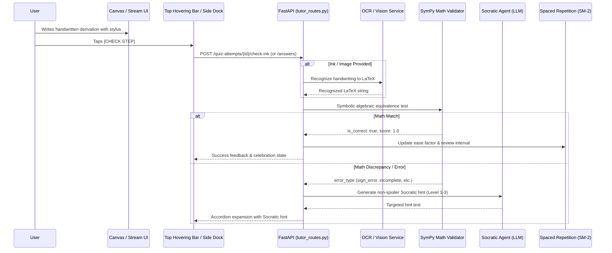

# Canvas Mode & Interactive Tutor

## 1. Overview & Inspirations
Canvas Mode brings spatial handwriting, freeform digital ink, and interactive Socratic tutoring to Archon.
The user experience takes direct inspiration from:
- **Duolingo & Mimo:** Active accountability with low cognitive friction — instant, in-place verification without leaving your flow.
- **Khanmigo & Brilliant:** Socratic scaffolding rather than immediate answer spoilers — tiered disclosure (`Nudge` → `Diagnostic Question` → `Methodological Hint` → `Worked Sub-step`).
- **GoodNotes, Apple Math Notes & Nebo:** Distraction-free digital ink canvas with low-latency stylus rendering, Cornell/grid templates, and MyScript Interactive Ink math recognition.

---

## 2. The Unified Dual-Mode Architecture

The mode supports two complementary view paradigms switchable via a top toggle:

### A. Practice / Exam Mode (Canvas-First)
- **100% Viewport Ink Canvas:** Complete spatial freedom for long derivations, circuit diagrams, and scratchpad calculations.
- **Top Hovering Question Bar:** A floating rectangular island (`top: 24px`, centered, frosted glass):
  ```
  +-----------------------------------------------------------------------------------+
  | [Q 3/5] Solve for x:  2x² - 8x + 6 = 0                            [ ✓ CHECK STEP ]|
  +-----------------------------------------------------------------------------------+
  ```
- **In-Place Accordion Feedback:** Tapping `[CHECK STEP]` evaluates strokes via backend OCR & SymPy/LLM, smoothly expanding downward *inside the same rectangle*:
  ```
  +-----------------------------------------------------------------------------------+
  | [Q 3/5] Solve for x:  2x² - 8x + 6 = 0                            [  RE-CHECK  ]  |
  |-----------------------------------------------------------------------------------|
  | 💡 Tutor: Good factorization of 2(x² - 4x + 3)! In your final roots step, check   |
  |           the sign of the second factor (x - 3)(x - 1).                           |
  | [Request Hint]                                                [Next Question →]   |
  +-----------------------------------------------------------------------------------+
  ```

### B. Learn Mode (Continuous Stream)
- **Vertical Learning Stream:** Modeled after interactive notebooks and ChatGPT/Claude study modes:
  1. **Theory Block:** High-density conceptual explanation with LaTeX formulas and diagrams.
  2. **Dedicated Canvas Sandbox:** Embedded digital ink block directly beneath the theory for solving the checkpoint.
  3. **Check Step Button:** Anchored in the sandbox footer to verify mastery before unlocking downstream sections.
  4. **Progressive Unlocking:** Step-by-step topic mastery with adaptive difficulty.
- **Floating Tutor Control Panel (Side Dock):**
  - Dedicated side button opening a slide-over tutor chat drawer.
  - Allows adapting notes in real-time (*"make the theory notes more visual"*, *"explain using an aerodynamic analogy"*, *"make the next question harder"*).

---

## 3. Architecture & Data Flow



---

## 4. Key API Endpoints

Managed primarily by `backend/tutor_routes.py` and `backend/ocr_routes.py`:

* `GET /notebooks/{id}/quiz-questions` — List questions (supports `due_only` for spaced repetition).
* `POST /notebooks/{id}/quiz-attempts?question_id={id}` — Start an active attempt.
* `POST /quiz-attempts/{id}/answers` — Submit student LaTeX answer for SymPy/LLM validation.
* `POST /quiz-attempts/{id}/hints` — Request tiered Socratic hint (Level 1: Nudge, Level 2: Error-focused, Level 3: Next step).
* `POST /quiz-attempts/{id}/finalize` — Finalize attempt and recalculate SM-2 interval.
* `POST /tutor/chat` — Contextual dialogue with the tutor to adapt notes, explain theory, or request tailored questions.
* `POST /canvas/evaluate-strokes` — Direct ink stroke / image evaluation for clients without local OCR.

---

## 5. Data Models & Database Schema

Stored in LanceDB via `quiz_manager.py`:
- **`QuizQuestion`**: `question_id`, `notebook_id`, `topic`, `difficulty`, `question_latex`, `expected_answer_latex`, `spaced_repetition_json`.
- **`QuizAttempt`**: `attempt_id`, `question_id`, `status`, `student_answer_latex`, `hints_requested`, `score`, `time_spent_seconds`.
- **`LearningLesson`**: `lesson_id`, `topic`, `theory_markdown`, `checkpoints_json`.

## 6. Web Frontend Implementation (`CanvasMode.tsx`)
The web application provides a high-performance cross-platform digital inking environment inspired by **StarNote**, **GoodNotes 6**, and **Apple Notes**:
* **High-DPI Inking Engine**: Responsive HTML5 canvas supporting Bézier curve smoothing, variable stroke width, and pressure simulation.
* **8-Tool Floating Palette**:
  - `Pen`: Fine inking with dark/light obsidian contrast.
  - `Pencil`: Textured graphite sketching.
  - `Highlighter`: Translucent overlay with blend mode.
  - `Eraser`: Precise stroke-intersection erasure.
  - `Lasso Tool`: Ray-casting selection loop, dashed bounding box, live drag-to-move translation, duplicate, recolor, and batch delete.
  - `Study Tape Tool (StarNote signature)`: Draws opaque pastel tape strips over formulas or answers; tap to toggle reveal/hide for active recall flashcard testing, plus a global reveal-all/hide-all button.
  - `Shape Snapping`: Recognizes straight lines and circular/elliptical loops and snaps to clean geometry.
  - `Scratch-to-Erase`: Detects rapid horizontal/vertical zigzag scribbles and instantly erases underlying strokes.
* **Paper Templates**:
  - Cornell Notes (title banner, cue column, notes area, summary footer).
  - Dot Grid (28px spacing).
  - Ruled / Lined (32px line height with left margin guide).
  - Graph / Grid (24px coordinate grid).
  - Blank Paper with Dark Obsidian (`#0E1013`) or Cream Paper themes.
* **Unified Dual-Mode UI**:
  - **Practice Mode**: Full-screen canvas with a top hovering question island (`[Q 1/5] ... [✓ CHECK STEP]`). Tapping check triggers in-place accordion expansion with Socratic feedback.
  - **Learn Mode**: Vertical continuous stream of theory cards alternating with dedicated checkpoint ink sandboxes, accompanied by a slide-over **Watchful Tutor Chat** drawer.
* **Export**: Instant one-click PNG export (`archon-canvas-[timestamp].png`).

---

## 7. Android Implementation
Canvas Mode on Android provides low-latency front-buffered stylus rendering with native hardware integration:
* **`InkCanvasComposable.kt`**: Jetpack Compose wrapper for `androidx.ink` stroke rendering.
* **`LassoSelectionManager.kt`**: Ray-casting polygon containment, stroke batch translation, duplication, and color reassignment.
* **`StudyTapeManager.kt`**: Opaque masking and tap-to-reveal toggle state management.
* **`ShapeRecognizer.kt`**: Heuristic chord ratio and circularity evaluation for geometric shape snapping.
* **`ScratchToEraseDetector.kt`**: Direction reversal counter for instant scribble erasure.
* **`FloatingToolbar.kt`**: Draggable glassmorphic toolbar with 8 tools, 6 color swatches, and 3 stroke widths.
* **`CanvasHost.kt`**: Low-latency rendering pipeline with hardware palm rejection and motion prediction.

---

## 8. Verification & Test Coverage
* **Android**: Compiled cleanly via `./gradlew assembleDebug` and verified on Lenovo TB336FU (`HNY03WRL`).
* **Web Frontend**: Built cleanly via `npm run build` (Vite 7.3) with production bundles generated.
* **Backend**: 5 integration test suites in `backend/tests/test_canvas_tutor_backend.py` covering stroke evaluation, lesson stream generation, and Socratic hints.


