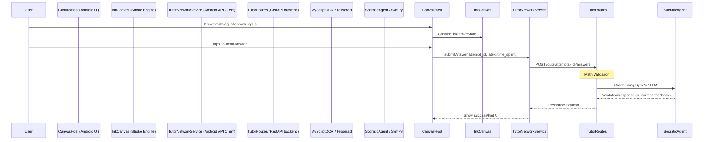

# Canvas Mode

## 1. Overview
Canvas Mode brings spatial reasoning, freeform drawing, and mathematical grading to Archon. Primarily implemented as a robust Android tablet interface (`CanvasHost.kt`), it supports stylus input, palm rejection, page-based layouts, and OCR-powered validation for math/physics homework. The backend provides an intelligent spaced-repetition tutoring system (`tutor_routes.py`) that grades handwritten derivations.

## 2. Architecture & Data Flow
Canvas Mode relies on the Android Ink API/Compose Canvas on the client side, interacting with standard REST endpoints on the backend for quiz logic and grading.

## 3. Key API Endpoints & WebSocket Messages

Unlike Chat and Council mode which rely heavily on WebSockets, Canvas Mode's integration primarily uses standard REST endpoints managed by `backend/tutor_routes.py`.

* `GET /notebooks/{notebook_id}/quiz-questions` - Fetches pending questions, optionally filtered by `due_only` (spaced repetition).
* `POST /notebooks/{notebook_id}/quiz-questions` - Manually or automatically seeds new questions.
* `POST /notebooks/{notebook_id}/quiz-attempts?question_id={id}` - Starts a new attempt.
* `POST /quiz-attempts/{attempt_id}/answers` - Submits a final or partial answer (LaTeX or numeric).
* `POST /quiz-attempts/{attempt_id}/hints` - Requests progressively stronger hints.
* `POST /quiz-attempts/{attempt_id}/finalize` - Finishes the attempt and calculates the next SM2 spaced repetition interval.

## 4. Data Models / Database Schema

Managed by LanceDB in the backend via `quiz_manager.py`.

### QuizQuestion
* `question_id` (UUID)
* `notebook_id` (String)
* `topic` (String)
* `difficulty` (Int)
* `question_latex` / `expected_answer_latex` (Strings)
* `spaced_repetition_json` (Stores SM2 variables: `ease`, `interval`, `repetitions`, `next_review_date`)

### QuizAttempt
* `attempt_id` (UUID)
* `question_id` (UUID)
* `status` (Enum: active, completed, failed)
* `student_answer_latex` (String)
* `time_spent_seconds` (Int)

## 5. UI Component Tree
* **Android Specific**:
  * `CanvasHost` (`com.example.archonnotesinkcanvas.ui.canvas.CanvasHost`)
    * `InkCanvas` (Handles actual stroke rendering and interaction)
    * `FloatingToolbar` (Pen, Color, Stroke width, Undo/Redo overlaid on canvas)
    * `PageThumbnailStrip` (Bottom navigation for multi-page canvas layouts)

## 6. Android Implementation
Canvas Mode is a native citizen of the Android ecosystem, optimized for stylus hardware:
* **Palm Rejection**: Heuristics check (`PalmRejectionHelper.kt`) touch size and tool type to drop spurious inputs.
* **Low Latency Rendering**: Uses `LowLatencyRenderer.kt` hardware buffers when available to reduce stylus trailing.
* **Motion Prediction**: `CanvasMotionPredictor.kt` predicts ahead of touch events to render smoother lines.
* **OCR Integration**: Interfaces with `MyScriptOcrService` to seamlessly convert ink strokes to LaTeX equations before submitting to `TutorNetworkService.kt`.

## 7. Known Issues / Open TODOs
* **isDrawing state propagation**: In `CanvasHost.kt`, `isDrawing` is initialized but assumes connection to `InkCanvas` for auto-hiding the toolbar. (TODO: Hook up gesture listeners to properly toggle `isDrawing`).
* **Cross-platform parity**: There is currently no web equivalent for Canvas Mode. It requires the Android daemon/app.
* **Stroke Synchronization**: Multi-device sync for real-time collaboration (`test_e2e_canvas_sync.py`) can encounter race conditions under poor network conditions.
