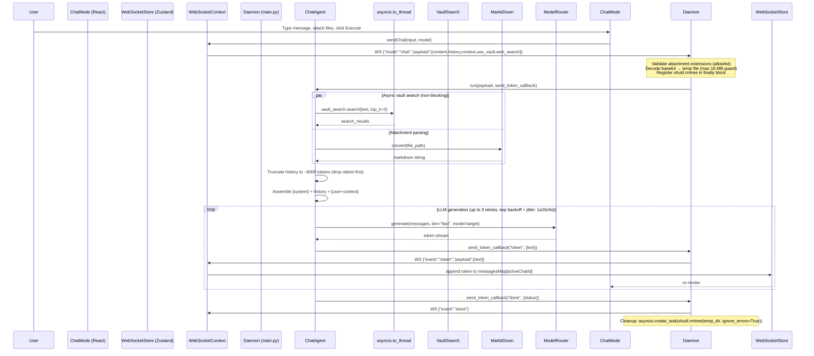

# Chat Mode

## 1. Overview
Chat Mode is the primary conversational interface for Archon. It provides real-time, streaming dialogue with an AI assistant over a persistent WebSocket connection. Key capabilities:

- **Multi-turn history** with an 8,000-token rolling context window (oldest messages dropped first)
- **Dynamic file attachment** — up to 16 MB per file; allowed types: `.pdf`, `.txt`, `.md`, `.docx`, `.pptx`, `.png`, `.jpg`, `.jpeg`
- **Vault-grounded context** — optional semantic search of the knowledge vault (LanceDB), injected into the system prompt via `asyncio.to_thread` (non-blocking)
- **Live model switching** — change LLM mid-session without reconnecting
- **Web search toggle** — enables provider-native grounding (Gemini: `googleSearch`, xAI/Grok: `search_parameters`)
- **Grounded chat variant** (`GroundedChatAgent`) — two-pass generation with inline citation verification, fully streaming

---

## 2. Architecture & Data Flow



### Grounded Chat Variant (GroundedChatAgent)

Used when `mode == "chat_grounded"` (Notebook RAG context). Two-pass pipeline:

1. **Pass 1 — Draft**: LLM streams tokens directly to the user via `send_token_callback("token", ...)` while building the draft in a buffer simultaneously.
2. **Pass 2 — Verification**: `CitationVerifier` (instantiated once per agent lifecycle in `__init__`) verifies claims against retrieved chunks and streams the verified final response.
3. Returns `{"response": verified_response, "citations": [{source_id, text, page}]}`.

---

## 3. Key API Endpoints & WebSocket Messages

### WebSocket Connection
- **URL**: `ws://<daemon-host>:<port>/ws`
- **Auth**: JWT Bearer token passed as `Authorization` header or `?token=<jwt>` query param

### Client → Server (send)
```json
{
  "id": "req-<uuid4>",
  "mode": "chat",
  "payload": {
    "content": "Explain the Navier-Stokes equations",
    "model": "groq/llama-3.1-8b-instant",
    "history": [
      {"role": "user",      "content": "Hello"},
      {"role": "assistant", "content": "Hi! How can I help?"}
    ],
    "context": {
      "attachments": [
        {"name": "notes.pdf", "content": "<base64-encoded-bytes>"}
      ]
    },
    "use_vault": true,
    "web_search": false,
    "req_id": "req-<uuid4>"
  }
}
```

### Server → Client (receive)
| Event | Payload | Description |
|-------|---------|-------------|
| `status` | `{"status": "Searching vault context..."}` | Processing step indicator |
| `token` | `{"text": " Paris"}` | Single streamed LLM token |
| `done` | `{"status": "success"}` | Stream completed |
| `error` | `{"error": "Attachment too large (max 16 MB)"}` | Error with description |

### Attachment Constraints (enforced server-side in `main.py`)
| Constraint | Value |
|-----------|-------|
| Max file size | **16 MB** (checked post-decode) |
| Allowed extensions | `.pdf` `.txt` `.md` `.docx` `.pptx` `.png` `.jpg` `.jpeg` |
| Transport | base64 inside WebSocket JSON payload |
| Temp file cleanup | `asyncio.create_task(shutil.rmtree(temp_dir, ignore_errors=True))` in `finally` |

---

## 4. Data Models / Database Schema

Chat sessions are **in-memory only** on the frontend. There is no persistent relational store for messages in the current schema.

### Frontend State (Zustand `websocketStore`)
```typescript
interface ChatMessage {
  id:      string;
  role:    "user" | "assistant" | "system";
  content: string;
  model?:  string;                  // Model ID shown for assistant messages
}

// Keyed by activeChatId (uuid string)
type MessagesMap = Record<string, ChatMessage[]>;

interface WebSocketStore {
  isStreaming:     boolean;
  availableModels: ModelMeta[];
  messagesMap:     MessagesMap;
}
```

### History Truncation Algorithm (in `ChatAgent.run()`)
Token estimate per message: `len(content) // 4`. Drop from the oldest history entry (never the system prompt or current user turn) until total estimated tokens ≤ **8,000**. A `WARNING` log fires if the estimate exceeds **6,000** tokens before truncation.

---

## 5. UI Component Tree

```
ChatMode (frontend/artifacts/archon/src/components/modes/ChatMode.tsx)
├── <input type="file"> [hidden]           # Native file picker, useFileAttach hook
├── ScrollArea (Radix UI)
│   └── div#message-list [max-w-4xl mx-auto space-y-6 pb-32]
│       ├── EmptyState                     # Rendered when chatMessages.length === 0
│       ├── MessageBubble × N
│       │   ├── Avatar
│       │   │   ├── [user]      <User /> icon, bg-panel-bg border
│       │   │   └── [assistant] <Bot />  icon, bg-blue-900/30 border-blue-500/50
│       │   └── ContentBubble
│       │       ├── [user]     plain whitespace-pre-wrap + CopyButton (hover reveal)
│       │       └── [assistant] <ReactMarkdown prose-invert> + CopyButton (hover reveal)
│       └── StreamingIndicator             # Shown while isStreaming === true
│           ├── <Loader2 animate-spin />
│           └── 3× bouncing dot (accent-indigo, staggered animation-delay)
└── InputBar (absolute bottom-0, gradient fade)
    └── GlassPanel [glass-panel border rounded-xl focus-within:border-blue-500/50]
        ├── Textarea                       # Enter→send, Shift+Enter→newline, ↑→recall last msg
        ├── CharCount (input.length)
        ├── PaperclipButton → openPicker() # Disabled without activeProjectId
        ├── ModelSelector (shadcn Select)  # Populated from Zustand availableModels
        └── ExecuteButton / StopButton     # Swaps conditionally on isStreaming
```

### Key Hooks & Context
| Hook / Context | File | Purpose |
|---|---|---|
| `useWebSocketContext()` | `context/WebSocketContext` | `sendChat`, `connected`, `cancelStream` |
| `useWebSocketStore()` | `store/websocketStore` | `isStreaming`, `availableModels`, `messagesMap` |
| `useProjectsContext()` | `context/ProjectsContext` | `activeProjectId`, `activeChatId`, `createChat` |
| `useFileAttach()` | `hooks/useFileAttach` | `openPicker`, `handleFilesSelected`, `inputRef` |

---

## 6. Android Implementation

[`ChatScreen.kt`](android/app/src/main/java/com/example/archonnotesinkcanvas/ui/screens/ChatScreen.kt)

| Concern | Implementation |
|---------|---------------|
| State management | `ChatViewModel` — `messages: StateFlow<List<ChatMessage>>` |
| Transport | Ktor WebSocket client (same WS protocol as web) |
| Message list | `LazyColumn`, auto-scroll on new item |
| Input | `OutlinedTextField` + attachment `IconButton` + send `IconButton` |
| Streaming | Collects `StateFlow` emissions; each token appended to last `assistant` message in-place |

---

## 7. Reference Products & Visual Benchmarks

* **Perplexity AI (perplexity.ai):** The single most important visual reference for Chat Mode's source-visibility problem. Perplexity's key innovation is keeping sources **always visible alongside the streaming answer** — users never leave the conversation to check a citation.
  - **Anchored right-side source drawer:** All cited URLs and vault documents appear in a fixed right panel (or below-fold on mobile) that persists across the full conversation scroll.
  - **Inline citation superscripts:** `[1]` badges appear inside the streaming answer body in real time — clicking them highlights that source in the drawer without modal navigation.
  - **Search / Vault toggle pills:** Visible toggle chips at the input bar label whether the response is `Web-grounded` or `Vault-grounded`. Maps directly to Archon's `use_vault` / `web_search` flags.
  - **Follow-up question suggestions:** After each answer, 3–4 follow-up chips appear inline. Maps to Archon's potential `suggested_follow_ups` field in the `done` WS event.
* **Google NotebookLM (notebooklm.google.com):** Reference for the `GroundedChatAgent` variant used in Notebook Mode's Chat Area. NotebookLM restricts answers strictly to uploaded source material and shows a "Sources used" summary panel after each response — the direct analog of Archon's `CitationVerifier` two-pass pipeline and the `citations` field returned in the `done` event.
* **PC ↔ Android Parity:** Web exposes the source drawer as a resizable right panel. Android (`ChatScreen.kt`) collapses sources into a swipe-up bottom sheet triggered by tapping an inline citation badge. The WebSocket protocol and citation data model are identical on both surfaces.

---

## 8. Known Issues / Open TODOs

| Issue | Severity | Notes |
|-------|----------|-------|
| **IndexedDB persistence missing** | Medium | `messagesMap` is Zustand in-memory only; page refresh loses all chat history. TODO: persist to IndexedDB or a backend session store |
| **Token batching stutter** | Low | Frontend batches tokens every 50 ms. Under fast Groq streaming the UI can stutter. Consider RAF-based batching |
| **Base64 attachment transport** | Medium | 16 MB base64 payload strains the WebSocket. TODO: move to presigned URL / chunked REST multipart upload endpoint |
| **Android attachment support** | Low | Android `ChatScreen.kt` does not yet implement file attachment UI; backend attachment path is ready |
| **No per-user server-side history** | Medium | Chat threads are session-scoped only; no server-side storage |
| **Web search UI indicator absent** | Low | When `web_search=true`, no visible indicator shows which tokens are web-grounded |

---

## 8. Recent Fixes & Improvements (2026-09-08)

| Fix | Category | Commit |
|-----|----------|--------|
| `datetime` NameError in `ServerLoadTracker` — `datetime.utcnow()` called without import | Bug | `e36c342f` |
| Temp file leak — `tempfile.mkdtemp()` never deleted; now cleaned via `asyncio.create_task(shutil.rmtree(...))` | Bug | `e36c342f` |
| Attachment 16 MB hard cap before `base64.b64decode()` — oversized files send error event and are skipped | Security | `e36c342f` |
| File extension allowlist — 8 allowed types only; unknown types rejected with WS error event | Security | `e36c342f` |
| Blocking vault search — `vault_search.search()` now wrapped in `await asyncio.to_thread(...)` | Perf | `e36c342f` |
| Silent `send_event` exception swallow — exceptions now logged before `pass` | Reliability | `e36c342f` |
| History truncation — rolling 8,000-token window, drops oldest history entries first | Reliability | `e36c342f` |
| LLM retry — 3 retries, exponential backoff + jitter (1 s → 2 s → 4 s) around `router.generate()` | Reliability | `e36c342f` |
| `CitationVerifier` moved to `__init__` in `GroundedChatAgent` — no per-request instantiation overhead | Perf | `e36c342f` |
| Grounded chat streaming — draft tokens now stream immediately; TTFT eliminated | UX | `e36c342f` |
| `req_id` tracing through all log statements in `ChatAgent` and `GroundedChatAgent` | Observability | `e36c342f` |
| Context window warning at 6,000 estimated tokens | Observability | `e36c342f` |

