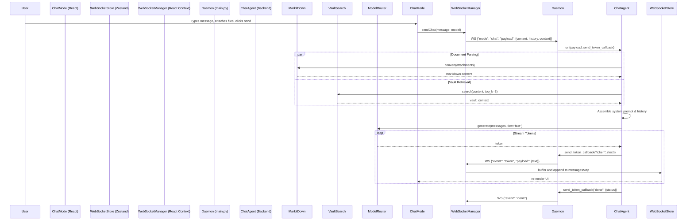

# Chat Mode

## 1. Overview
Chat Mode is the primary conversational interface for Archon, providing a real-time, streaming dialogue with an AI assistant. It supports multi-turn history, dynamic context attachment (files and images), and retrieved context from the knowledge vault. Unlike standard chat apps, Archon's Chat Mode allows direct execution of commands, seamless switching of language models during a session, and deep integration with the underlying file system via MarkitDown for attachment parsing.

## 2. Architecture & Data Flow
The architecture relies on a persistent WebSocket connection between the React frontend and the FastAPI backend. 



## 3. Key API Endpoints & WebSocket Messages

### WebSocket Messages Sent by Client
```json
{
  "id": "req-uuid",
  "mode": "chat",
  "payload": {
    "content": "What is the capital of France?",
    "model": "groq/llama-3.1-8b-instant",
    "history": [
      {"role": "user", "content": "Hello"},
      {"role": "assistant", "content": "Hi there!"}
    ],
    "context": {
      "attachments": [
        {"name": "file.txt", "content": "base64_encoded_string"}
      ]
    },
    "use_vault": true,
    "web_search": false
  }
}
```

### WebSocket Messages Received by Client
* **Status Updates**: `{"id": "req-uuid", "event": "status", "payload": {"status": "Generating response..."}}`
* **Token Streams**: `{"id": "req-uuid", "event": "token", "payload": {"text": " Paris", "model": "assistant"}}`
* **Completion**: `{"id": "req-uuid", "event": "done", "payload": {"status": "success"}}`

## 4. Data Models / Database Schema
There is no dedicated persistent relational database for chat sessions in the core schema; instead, state is maintained in-memory on the frontend and optionally synced to LanceDB or JSON logs depending on the system config.

### Frontend State (Zustand `websocketStore`)
```typescript
interface ChatMessage {
  id: string;
  role: "user" | "assistant" | "system";
  content: string;
  model?: string;
}

type MessagesMap = Record<string, ChatMessage[]>;
// Keyed by `activeChatId`
```

## 5. UI Component Tree
* `ChatMode` (`frontend/artifacts/archon/src/components/modes/ChatMode.tsx`)
  * `input type="file"` (Hidden native file picker for attachments via `useFileAttach`)
  * `ScrollArea` (Radix UI scrolling container)
    * `MessageBubble` (User and Assistant distinct styling)
      * `ReactMarkdown` (Renders markdown safely for assistant responses)
      * `CopyButton` (Clipboard utilities)
  * `InputContainer` (Bottom fixed area)
    * `Textarea` (User input)
    * `ModelSelector` (`Select` component for changing LLMs dynamically)
    * `Paperclip` (Attachment trigger)
    * `Send / Stop Stream Button`

## 6. Android Implementation
On Android, `ChatScreen.kt` implements a similar messaging interface, communicating typically via REST or Ktor Websockets. 
* **State Management**: `ChatViewModel` holds the `messages: StateFlow<List<ChatMessage>>`.
* **UI Structure**: Uses Jetpack Compose `LazyColumn` for the message list.
* **Input**: `OutlinedTextField` with an integrated attachment icon and send button.

## 7. Known Issues / Open TODOs
* **Message Batching**: Tokens are batched on the frontend (`batchTimeout.current = setTimeout(commitBufferedTokens, 50);`) but under heavy load (e.g. `groq` fast streaming), the UI can stutter.
* **Persistance**: Messages map is not fully persisted to `IndexedDB`, meaning refreshes can lose chat history if not stored in a persistent backend session.
* **Base64 Overhead**: Sending file attachments via base64 in the websocket payload limits the maximum file size. Large PDFs may cause the connection to drop. (TODO: Move to presigned URL uploads or dedicated chunked REST endpoint).
