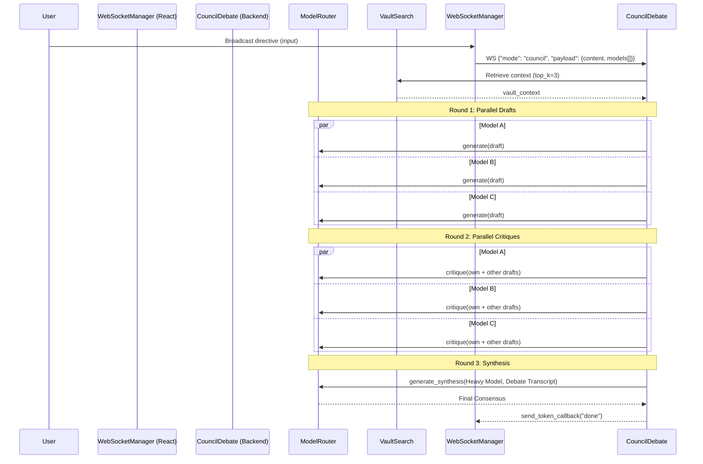

# Council Mode

## 1. Overview
Council Mode enables multi-agent debate and consensus generation. Rather than relying on a single language model, Council Mode provisions a panel of 3 fast-tier language models to generate parallel drafts and critiques, followed by a heavyweight model that synthesizes the debate transcript into a final, authoritative response. This is particularly useful for complex architectural decisions or multifaceted research questions where diverse "opinions" reduce hallucination and tunnel-vision.

## 2. Architecture & Data Flow
Council Mode runs through three distinct rounds managed by `CouncilDebate` (backend) and visualized via `CouncilMode.tsx` (frontend).



## 3. Key API Endpoints & WebSocket Messages

### Client Broadcast Payload
```json
{
  "id": "req-uuid",
  "mode": "council",
  "payload": {
    "content": "Evaluate a Modular Monolith vs Microservices for our Phase 1 launch.",
    "models": ["groq/llama-3.3-70b-versatile", "gemini/gemini-2.5-flash", "openrouter/deepseek/deepseek-r1:free"],
    "context": {
      "attachments": []
    }
  }
}
```

### Server Responses
* Streaming tokens specify the agent model to route text to the correct UI column:
  `{"id": "req-uuid", "event": "token", "payload": {"text": "...", "model": "groq/llama-3.3-70b-versatile"}}`
* For the final consensus, the `model` field is mapped to `"Council Consensus"`.

## 4. Data Models / Database Schema
Similar to Chat Mode, Council Mode messages are maintained in the frontend Zustand store.
```typescript
type CouncilMessages = Record<string, ChatMessage[]>;
// Keyed by the model ID or "Council Consensus"
```

## 5. UI Component Tree
* `CouncilMode` (`frontend/artifacts/archon/src/components/modes/CouncilMode.tsx`)
  * Top Bar: Status indicators, active role tags (Proposer, Critic, Domain Expert, Synthesizer), Export button.
  * Debate Area: Flex container split into vertical columns.
    * `CouncilColumn`: Maps to an active model. Displays messages generated by that model in rounds.
  * Verdict Area: Bottom panel displaying the synthesized consensus response.
  * Broadcast Bar: Input for injecting directives and context.

## 6. Android Implementation
On Android, `CouncilScreen.kt` provides an adaptive UI for tablets/foldables, scaling to show multiple columns side-by-side or a carousel on smaller screens. 
* Uses similar data structures and WebSocket events.
* `ViewModel` handles parallel streams and state aggregation.

## 7. Reference Products & Visual Benchmarks

* **ChatHub (chathub.gg):** The primary UI/UX reference for Council Mode. ChatHub broadcasts a single prompt to multiple LLMs simultaneously and renders each response in an independent, live-streaming column — exactly the pattern Archon's Council Mode mirrors. Key patterns to copy:
  - **Responsive grid layout:** 2, 3, or 4 model columns in a fluid flex grid (not fixed-size static boxes).
  - **Independent streaming per column:** Each model card streams tokens without waiting for others to complete.
  - **Model selector pills:** Inline pill toggles to add/remove models from the broadcast without leaving the view.
  - **Consensus synthesis panel:** An auto-generated final card at the bottom that summarizes where models agreed and diverged — maps directly to Archon's Round 3 Synthesis card.
* **PC ↔ Android Parity:** On tablet (`CouncilScreen.kt`), columns are shown side-by-side (2-up in landscape, carousel on compact). On web, the same flex-column layout scales from 2 to 4 panels. Both surfaces share the identical WebSocket multi-agent channel and parallel inference pipeline.

## 8. Backend Resilience Architecture (`council_debate.py`)

To ensure rock-solid stability during parallel multi-agent debate, `CouncilDebate` implements an enterprise-grade resilience layer:

1. **Per-Model Isolation & Timeout Safeguards:** Each model task in Round 1, 2, and 3 is wrapped with `asyncio.wait_for(..., timeout=45.0)`. A stalled or hanging provider is isolated after 45 seconds with an informative error token, allowing the remaining council members to proceed without locking the session.
2. **Exponential Backoff Retry with Random Jitter:** If a provider hits `HTTP 429 Too Many Requests` or transient network resets, `generate_completion_with_resilience` retries up to 2 times with exponential backoff:
   $$\text{backoff} = 2^{\text{attempt}} + \text{jitter}(0.2, 0.8)$$
3. **Context Truncation & Token Budgeting:**
   - Round 2 (Critique): Peer drafts are capped at $2,000\text{ characters}$ each to prevent prompt ballooning.
   - Round 3 (Consensus Synthesis): The debate transcript is capped at $7,000\text{ characters}$, with individual draft and critique snippets bounded to $1,200\text{ characters}$.
   - Shared Context: Attached files and vault snippets are bounded to $3,500\text{ characters}$.
4. **Visual Round Separation:** An explicit `\n\n---\n### Round 2: Critique & Refinement\n\n` delimiter is emitted before Round 2 tokens stream to prevent Round 2 text from collapsing into the Round 1 draft in the UI.
5. **Telemetry & Metrics:** Returns `round_latencies_ms` (for Round 1, 2, and 3), `total_elapsed_ms`, and `total_tokens_estimated`.

## 9. Known Issues / Open TODOs
* **Export feature limitation**: Markdown export does not capture inline media or attached files correctly.
* **Model Selection Diversity**: UI should optionally suggest picking models from different providers (e.g. 1 Groq + 1 Gemini + 1 OpenRouter) to minimize single-provider queue congestion.
