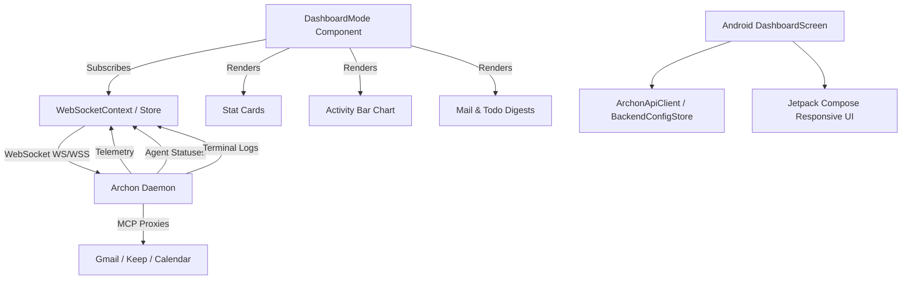

# Dashboard Mode

## 1. Overview
The Dashboard Mode serves as the central command center for the Archon Operating System. It provides a unified view of active agents, token usage telemetry, unread mail via MCP, and pending tasks. It integrates a 7-day activity chart, a calendar widget, real-time activity feed from the daemon terminal, and quick launch actions to navigate to other modes (Chat, Council, Deep Research, Agents, etc.).

## 2. Architecture & Data Flow

## 3. Key API Endpoints & WebSocket Messages
- **WebSocket Subscriptions**:
  - `agentStatuses`: List of running/idle agent processes.
  - `telemetry`: Metrics for tokens used and estimated cost.
  - `terminalLines`: Feed of system, input, and error logs.
  - `calendarEvents`: Synced events for the schedule widget.
- **MCP Calls (Conceptual)**:
  - Mail sync relies on Gmail MCP to pull summaries.
  - Todo sync relies on Google Keep MCP.

## 4. Data Models / Database Schema
**Frontend Types:**
- `MailItem`: `id`, `sender`, `subject`, `preview`, `date`, `fullSummary`, `unread`
- `TodoItem`: `id`, `text`, `done`, `list`
- `ActivityBucket`: `day`, `commands`, `tokens`

**Android Data Classes:**
- `DashboardStat`: `id`, `label`, `value`, `sub`, `icon`, `accentColor`
- `AgentProcess`: `id`, `name`, `action`, `status`
- `ActivityLogEntry`: `id`, `timestamp`, `text`, `kind`
- `MailDigestItem`, `TodoItem`, `CalendarEvent`, `QuickActionItem`

## 5. UI Component Tree
- `DashboardMode` (React Context & Store integration)
  - `DashboardHeader` (Uptime counter, Connection status)
  - `StatCard` (x4 - Active Agents, Tokens Used, Unread Mail, Tasks Pending)
  - `SvgBarChart` (Pure SVG implementation to avoid Recharts React 19 hook conflicts)
  - `CalendarWidget` (Daily schedule)
  - `AgentRow` (Active process indicators)
  - `MailModal` (Framer Motion dialog for reading email summaries)
  - `QuickAction` (Grid buttons for navigating App modes)

## 6. Android Implementation
Implemented in `DashboardScreen.kt` using Jetpack Compose with strict responsive behaviors (`WindowSizeClass`):
- **Expanded (>= 840dp)**: Multi-column layout using weights (Stats inline, Activity/Calendar split, Agent/Logs split).
- **Medium (600dp - 839dp)**: 2-column layout.
- **Compact (< 600dp)**: Single-column vertically scrollable view with 2x2 stats grid.
- **Parity Dataset**: Fallback hardcoded datasets (`defaultStats`, `defaultMailItems`, etc.) are provided for UI development and testing when the backend is disconnected.
- **Canvas Chart**: Activity Bar Chart is custom-drawn using Compose `Canvas` for optimal performance.

## 7. Reference Products & Visual Benchmarks

* **Linear (linear.app):** Primary reference for the Dashboard's information density, typography, and color discipline. Linear is the gold standard for "beautiful, dark, dense productivity UI." Key patterns to copy:
  - **Obsidian/slate dark mode** — `#0F0F0F` to `#1A1A1A` background range; zero pure-white text (use `#E8E8E8`).
  - **1px subtle borders** — separators use `rgba(255,255,255,0.06)`, not thick dividers.
  - **Dense typography (Geist/system sans)** — section headers at 11px uppercase tracking-widest; metric values at 28–32px; sub-labels at 12px muted.
  - **Restrained micro-interactions** — hover states shift background by 4% opacity; `ease-out-quart` transition at 150ms. No bouncy animations.
  - **High-information metric cards** — each card shows: large primary value, secondary trend label ("+12% vs last week"), and a single supporting sparkline. No decorative icons unless they carry signal.
* **macOS Mission Control:** Reference for the quick-launch quadrant grid — app mode tiles should feel like macOS Space thumbnails: live, glanceable previews of each mode's current state, not generic static buttons.
* **PC ↔ Android Parity:** Web uses the multi-column `DashboardMode` layout with SVG bar chart and full mail/calendar widgets. Android (`DashboardScreen.kt`) uses `WindowSizeClass`-responsive layouts (expanded 3-col → medium 2-col → compact 1-col) with the same data model (`DashboardStat`, `AgentProcess`, `ActivityLogEntry`).

## 8. Known Issues / Open TODOs
- **Mock Data Dependency**: Android currently uses default hardcoded datasets. Needs to be wired fully to the `ArchonApiClient` WebSockets.
- **Chart Tooltips**: Custom SVG Bar Chart hover tooltips occasionally overflow on smaller window sizes.
- **Uptime Sync**: Uptime counter is currently client-side. Should synchronize base timestamp from the Daemon.
