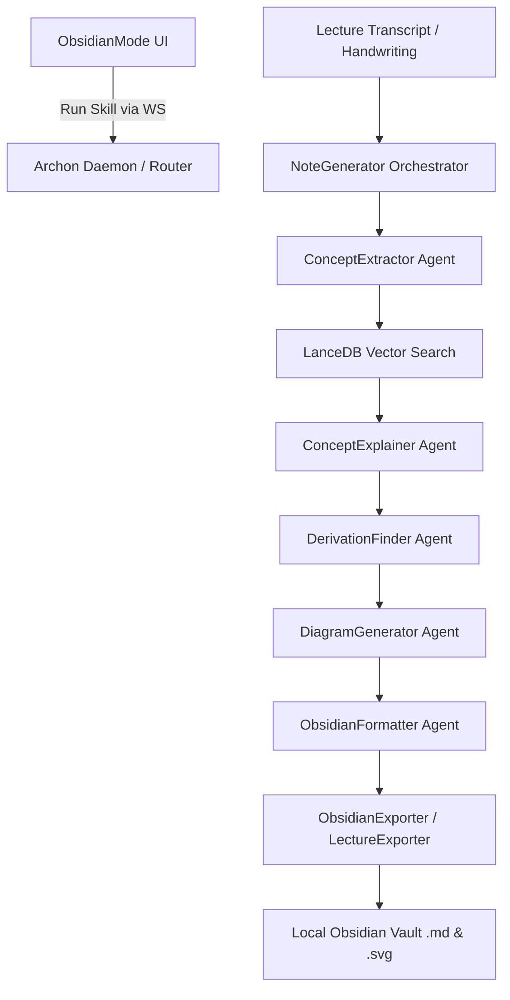

# Obsidian / Notes Mode

## 1. Overview
The Obsidian / Notes Mode acts as an intelligent bridge between the Archon OS and the user's Obsidian Vault. It features a UI for triggering specialized "Skills" (Daily Briefing, Vault Search, Knowledge Graph generation, etc.) and scheduling recurring AI tasks. 
On the backend, it provides a comprehensive pipeline (`NoteGenerator`) that orchestrates 5 distinct AI agents to process lecture transcripts and handwriting, query LanceDB for textbook context, generate diagrams, and directly write properly formatted Markdown files (and sidecar metadata) to the local file system using `ObsidianExporter` and `LectureExporter`.

## 2. Architecture & Data Flow

## 3. Key API Endpoints & WebSocket Messages
- **Frontend Trigger**: `sendChat(skill.prompt, model)` over WebSocket to initiate a skill in the daemon.
- **Backend Generators**:
  - `generate_lecture_notes()`: Orchestrates the 5-agent pipeline with asynchronous `progress_callback` updates.
  - `export_page()`: Handles binary ink stroke conversion to SVG, sidecar OCR JSON generation, and Markdown compilation.
  - `save_lecture_note()`: Writes note content and auto-updates the vault's `Index.md`.

## 4. Data Models / Database Schema
**Frontend Types:**
- `Skill`: `id`, `icon`, `name`, `description`, `prompt`, `category`, `color`, `bg`, `border`
- `ScheduledTask`: `id`, `skillId`, `skillName`, `time`, `days`, `enabled`

**Backend Metadata Payload:**
- `sidecar_data`: `page_id`, `notebook_id`, `recognized_text`, `tokens`, `math_formulas` (LaTeX), `myscript_job_id`, `provider`

## 5. UI Component Tree
- `ObsidianMode`
  - `Category Filter` (All, Briefing, Research, Productivity, Creative)
  - `SkillCard` (Displays name, description, and action buttons)
  - `Scheduled Tasks List` (Displays active cron schedules)
  - `ScheduleModal` (Framer Motion popup for selecting time and active days)
  - `AddSkillModal` (Form to define custom AI prompts and categories)

## 6. Android Implementation
While the direct `ObsidianMode` React port isn't explicitly named on Android, the mobile app interacts heavily with this ecosystem via its Canvas / Handwriting implementations (e.g., MyScript Stylus integrations in `TutorModeScreen` or `DashboardScreen`). 
The Android app generates binary stroke data and sends it to the backend `ObsidianExporter`, which reconstructs it into SVG files and Markdown math blocks for the vault.

## 7. Known Issues / Open TODOs
- **Vector Context Limits**: `LanceDB` retrieval can sometimes pull too much textbook context, blowing up the prompt token limit. Currently mitigated by querying only the top 5 topics.
- **Cron Scheduling**: The frontend UI can create scheduled tasks, but the Daemon side needs a robust background worker (like Celery or APScheduler) to accurately trigger these skills when the frontend is closed.
- **Index Merge Conflicts**: `LectureExporter.update_index_file()` parses simple string splits; it might fail or duplicate entries on heavily modified `Index.md` files. Needs an AST-based Markdown parser.
